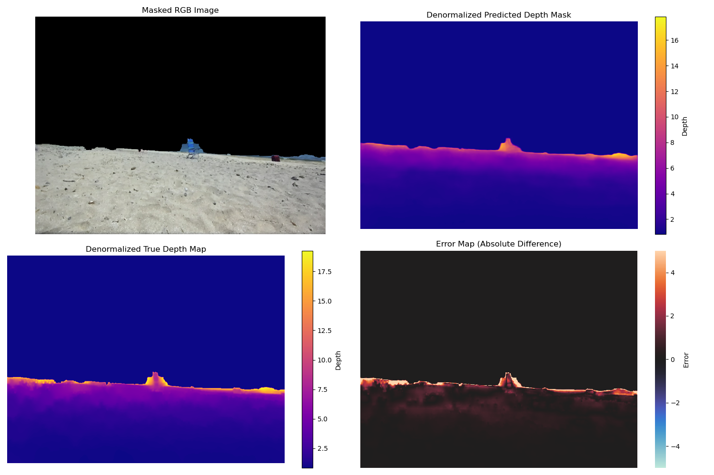
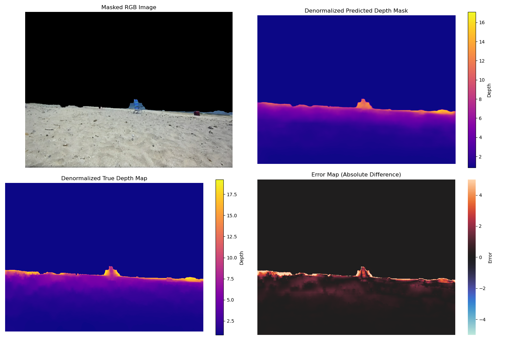

# Pose Aware Monocular Depth Estimation Project

## 📌 Project Overview
This repository contains the code for training and deploying different **monocular depth estimators** designed for resource-constrained mobile robots. The goal was to enhance depth estimation by integrating pose information and leveraging scale cues from the environment. To test different pose encoding techniques the model is designed to dynamically increase/decrease the number of input channels based on the parameters in the training and inference scripts.

This project investigated the qualitative and quantitative improvements that can be obtained while incorporating either relative camera motion measurements or absolute camera position measurements into the training and inference pipeline for monocular depth estimation model designed to process isolated images on a micro-rover with no pose estimation sensors. The pose measurements were obtained using the rear-facing camera of the rover, scale-cues available in the rear-view of the rover (i.e. tire tracks and other known-size landmarks), and a monocular pose estimation algorithm implemented in my [Pose Estimator Repository](https://github.com/dkadiry/final-pose-estimator).

We see some qualitative improvements in object boundary detection and mid-range error gradients after including absolute pose values in model training and inference. Refer to my MSc Thesis document for full a discussion. (Link will be included upon thesis publication)

### **Key Features:**
- Uses **U-Net architecture** for depth estimation.
- Incorporates **pose maps as auxiliary input** to improve depth accuracy.
- Can be **trained from scratch** using the train.py script
- Includes [training configuration](config/training_config.yaml) and [inference configuration](config/inference.yaml) files which contain dataset, model, training, and results parameters that can be modified depending on:
    - The dataset directory that you include
    - The type of model you want to train (Pose Enhanced or Vanilla)
    - The model training parameters
    - The location of the folder you want to store your generated results   
- The training script expects a pre-trained U-net model to be loaded and performs weight transfer for you.
- This project used a model pre-trained on the DIODE Image-depth map dataset.

## ⚙️ Setup Instructions
### **1. Clone the Repository**
```bash
git clone https://github.com/dkadiry/pose-aware-monocular-depth-estimator.git
```
### **2. Install Dependencies**
You can install all required dependencies using the included environment.yml file and creating a conda environment:

```bash
conda env create -f environment.yml
conda activate myokadirienv
```

### **3. Train Your Own Model**
Since the trained model is not included in this repository, you can train your own using the provided training script "train.py".

## Datasets
The model was fine-tuned on a custom dataset collected at a beach. The dataset used for pre-training and fine-tuning are not included in this repo. You will need to perform model pre-training and training using either your own data or publicly available datasets like the DIODE dataset.


## 📊 Some Qualitative Results
Below are some example outputs generated by the Vanilla depth estimator (Not trained to utilize pose), Relative Pose Boosted Depth Estimator (Trained to Utilize relative camera motion), Absolute Pose Boosted Depth Estimator (Trained to Utilize Absolute Camera position in Z Axis). 

Each result in the following order (from left to right, top to bottom):
1. **Masked RGB Image Input**
2. **Generated Depth Map** *(Note: There is a typo in the sample image; it should say "Depth Map" instead of "Depth Mask.")*
3. **Ground Truth Depth Map**
4. **Error Map** (Evaluates pixel-wise differences between the Ground Truth and the Generated Depth Map.)

The performance of all depth estimation models were compared qualitatively using the overall MSE, MAE, and RMSE error metrics of the models on the full testing dataset. I also implemented a per sample histogram analysis of each model's error metrics in RMSE, MAE, and MSE to further validate the conclusions drawn from the qualitative analysis.

- **MSE (Mean Squared Error)**: Measures the average squared differences between predicted and actual depth values.
- **MAE (Mean Absolute Error)**: Measures the absolute differences, making it more interpretable.
- **RMSE (Root Mean Squared Error)**: Similar to MSE but penalizes large errors more heavily.

### Vanilla Model Inference Sample


### Best Performing Absolute Z Model Inference Sample


### Best Performing Relative Pose Model Inference Sample (Includes motion in Z, Pitch, and Roll)


For a **full set of results**, visit: **[OneDrive Link](https://1drv.ms/f/s!AtGE4PPlBPZmifZNIX6diSPdNaXK1A?e=f0Dpof)**.

If you are interested in the full discussion of my results and observations, please take a look at my MSC Thesis linked here. (Link will be included upon thesis publication)


## 📖 Acknowledgments
This work is part of my MSc thesis at **Western University**, titled:
**"Investigating the Influence of Scale Cues and Pose Integration on AI-Based Monocular Depth Estimation for Resource-Constrained Mobile Robots."**

For citations, please refer to my thesis document (link will be included upon thesis publication).


